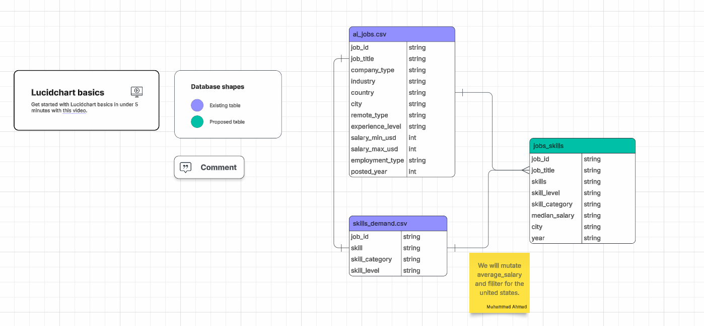

# Project 3 \| Data Science \| Most Valued Skills

## Team Members:

Ciara Bonn, Jess Chen, Muhammad Ahmad, Nana Kwasi Danquah

## Approach

We will investigate which data science skills are most valued by analyzing LinkedIn job posting data from Kaggle. We will use postings.csv, job_skills.csv, and skills.csv to identify the skills requested in data-science-related job postings. In R, we will filter the data to relevant roles, clean missing or duplicate values, join the tables by job and skill identifiers, and store the results in normalized relational tables. We will then perform exploratory analysis to rank the most frequently requested skills and visualize the results with charts.

As a team, we will utilize our slack channel as our primary form of communication and a team github repo to store working files. We will update file names with versions numbers to manage version control.

## ER Diagram Potential Data sets:



Primary keys are the job_ids.

primary data sets:\
<https://www.kaggle.com/datasets/mann14/global-ai-and-data-science-job-market-20202026?select=country_ai_trends.csv>

possible data sets to support primary:

<https://www.kaggle.com/datasets/arshkon/linkedin-job-postings>\
<https://www.kaggle.com/datasets/asaniczka/1-3m-linkedin-jobs-and-skills-2024>

### Data cleaning by Muhammad Ahmad and Nana Kwasi Danquah

# Load the data

```{r}
library(dplyr)
library(ggplot2)
library(naniar)
library(tidyr)
```

```{r}
data_jobs_raw <- read.csv("https://raw.githubusercontent.com/JessChen0/Assignment_3_Data_Science_Skills/refs/heads/main/ai_jobs.csv")

skills_raw <- read.csv("https://raw.githubusercontent.com/JessChen0/Assignment_3_Data_Science_Skills/refs/heads/main/skills_demand.csv")

data_jobs
```
Based on the summary there are no big errors or weirdly small or large numbers.
# Check for null or missing rows

```{r}
vis_miss(data_jobs_raw)
vis_miss(skills_raw)
```
Heat maps to check for any missing values. There are no missing values in this data set.

# Filiter the data sets by country (we just want USA)

```{r}
data_jobs_filtered <- data_jobs_raw %>% filter(country =="USA") 

data_jobs_USA <- data_jobs_filtered %>% select(-country)
data_jobs_USA
```
Filtered for "USA" then got rid of the column since it is not necessary anymore

# Converting skills from long to wide

```{R}
skills_wide <- skills %>%
  pivot_wider(
    id_cols  = job_id,
    names_from = skill,
    values_from = skill_level
  )

skills_wide
```
Here is the wide version of skills I thought this will be the best way to go about it because now we can do numerical operations more conveniently and without having to make a column for every skill level.

# Combining them into a new table

```{r}

jobs_skills <- data_jobs_USA %>%
  select(job_id, job_title, city, salary_min_usd, salary_max_usd, posted_year) %>%
  left_join(
    skills_wide %>% select(job_id, R, `Computer Vision`, NLP, SQL, Python, AWS, Azure, GCP, PyTorch, `Scikit-learn`, TensorFlow),
    by = "job_id"
  ) %>% 
  mutate( avg_salary = (salary_min_usd + salary_max_usd) / 2) %>%
  select(-salary_min_usd, -salary_max_usd )
```

```{r}
jobs_skills
```

